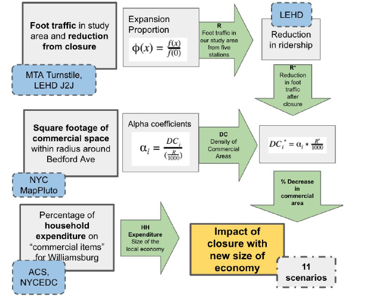

# L-train-Closure-economic-impact
###calculating the economic impact on the Brooklyn area resulting from closing down two L train subway stations. 
#### Urban Science Intensive Project for the Center of Urban Science and Progress at New York University
##### Contributors:
##### - Dan Quasney (www.brunchline.co)
##### - Diego Garzòn (https://dfgarzon.weebly.com)
##### - Maria Ortiz (https://github.com/maryooh)
##### - Manushi Majumdar (https://github.com/ManushiM)

Repo for the USI social impact project

This repo includes all relevant files for the USI social impact project

Four notebooks comprise the total methodology:
usi_turnstile.ipynb - reads in turnstile data and wrangles it down to number of exits per turnstile per station per day 

usi_loss.ipynb - estimates size of the Williamsburg economy and size of the economy within a quarter mile radius of the Bedford Ave. station

usi_foot_traffic.ipynb - first pass estimate on measuring the impact of reducing the amount of foot traffic in the area

usi_final_calculations - combines ui_loss and usi_foot_traffic to determine estimated financial impact on the local economy

USI_L-train.pdf - the complete report of the project, including goals, methodology, results, conclusions and social impact

usi_L_train_team_12.pdf - slideshow that provides an overview of the project 

- Methodology diagram

